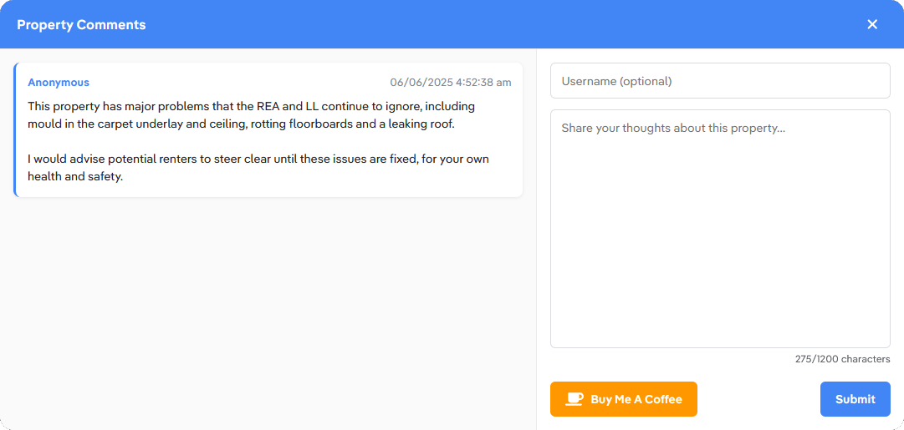

<div align="center">


<h1>Real Estate Comments</h1>

This browser extension adds a comment section to [realestate.com.au](https://www.realestate.com.au) and [domain.com.au](https://www.domain.com.au) property listings, allowing users to view and submit comments about properties to give potential renters an idea of what the property conditions are really like.

<br />
</div>

# Installation - Chrome Web Store/Firefox Add-ons

1. Download the extension from
  - **[Chome Web Store](https://chromewebstore.google.com/detail/fpmhogbiebniapjfkbhgeacgkgpjaenn)**
  - **[Firefox Add-ons](https://addons.mozilla.org/en-US/firefox/addon/real-estate-comments/)**
2. Refresh any open realestate.com.au tabs

# Installation - Unpacked Source

### Prerequisites
- Node 22.x
- pnpm 10.x

### Steps
1. Clone and build the extension
```bash
git clone https://github.com/zevnda/real-estate-comments.git
cd real-estate-comments
pnpm install  # or npm install
pnpm build  # or npm run build
```

2. Load the extension
- **Chrome**:
  - Go to `chrome://extensions/`
  - Enable `Developer mode`
  - Click `Load unpacked` and select `dist/chrome`
- **Firefox**:
  - Go to `about:debugging#/runtime/this-firefox`
  - Click `Load Temporary Add-on` and select `dist/firefox/manifest.json`

[Chrome Written Guide](https://developer.chrome.com/docs/extensions/mv3/getstarted/development-basics/#load-unpacked) | [Firefox Written Guide](https://developer.mozilla.org/en-US/docs/Mozilla/Add-ons/WebExtensions/Your_first_WebExtension#installing) | [Chrome/Firefox Video Guide](https://www.youtube.com/watch?v=dhaGRJvJAII)

# Usage

- Navigate to a property listing on [realestate.com.au](https://www.realestate.com.au) or [domain.com.au](https://www.domain.com.au)
- A blue/white comment button will appear in the bottom-right of the listing page
- Click the button to view other users' comments or create your own comment